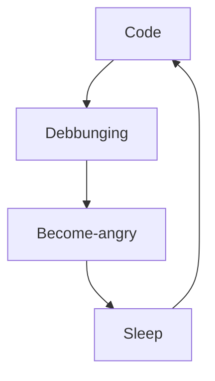

**Hello World !**

You are in my github profil *( but I think you know that... )*

- 🔥 I'm a junior developper.
- 🔖 I work for my personal project.

### My Programming language & Frameworks :

 

 
 

  
### My Tools :

  
 

### My routine :

 

### My github stats :

 

### My lasts articles :

<!-- BLOG-POST-LIST:START -->

<!-- BLOG-POST-LIST:END -->
 

Go on my website :

